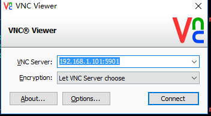
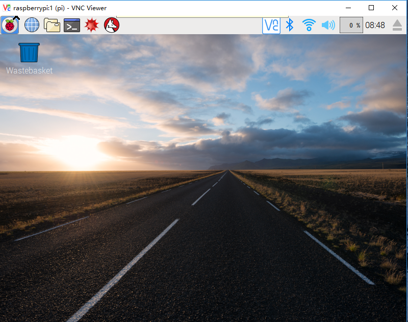
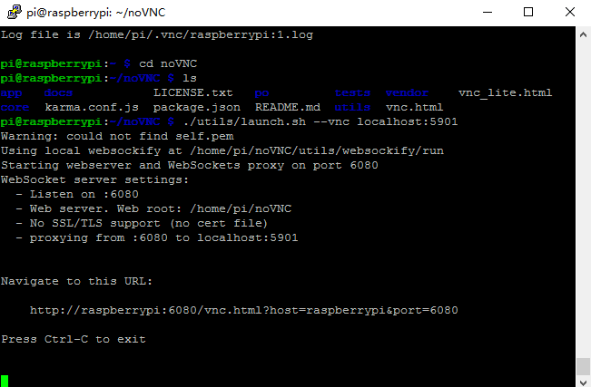
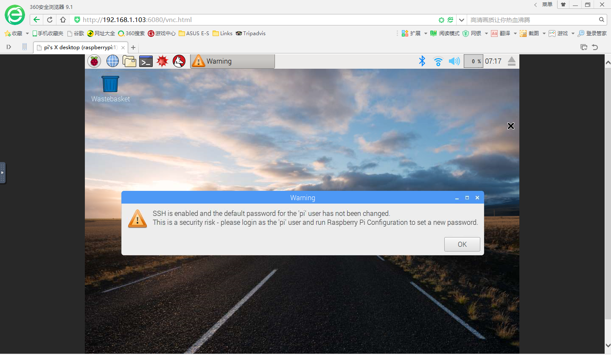
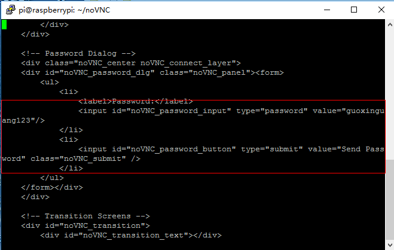

# 树莓派安装vncserver及noVNC实现浏览器远程访问桌面

## 一、确保树莓派联网

树莓派3b+具有无限网卡，树莓派可以连无线网使用（当然有线连接也可以，现在推崇无线时代嘛）。树莓派配置wifi很简单，使用sudo vim.tiny /etc/wpa_supplicant/wpa_supplicant.conf进入配置文件，在文件最后添加如下内容：

```python
network={
  ssid="WIFINAME"
  psk="password"
}
```

其中，引号中WIFINAME填写wifi名称，引号中password填写密码，之后:wq保存（一定注意只有超级权限才可以修改配置文件），重启树莓派之后即可连接上wifi。

## 二、更新源

下载东西之前，想到的第一件事是更新源，这是一种好的习惯，保证自己下载时的源处于最新状态，使用```sudo apt-get update```，当然这也不是必须的，根据自己的习惯和需要决定，

## 三、下载安装vncserver和VNC-Viewer
使用```sudo apt-get install tightvncserver```下载vnc服务端。

如果PC机是windows操作系统，可以通过我分享的百度网盘链接来下载[VNC-Viewer-5.0.3](http://pan.baidu.com/s/1dF6fGm1)

## 四、启动vncserver

使用```vncserver -geometry 800x600 :1```来启动vnc服务器程序，使用```vncserver -kill :1```来关闭vnc服务器程序。命令行参数说明：

1表示指定控制台的号码，启动多个控制台，可以提供互不影响的多个桌面环境。可以不加此参数，tightvncserver会自动寻找从1开始的下一个空闲控制台。若加上此参数，会强制使用指定的控制台，如果此控制台已经启动则报错。加此参数可有效防止无意多次启动程序（会启动多个控制台）白白浪费系统资源。

此外还有一个特殊的0号控制台，0号控制台就是连接真实显示器真正输出图像的那个桌面。对于vnc客户端，不输入端口号登录，默认就登录到0号控制台，方便。但是因为0号是真正的桌面，所以和开机启动桌面环境，或者自己使用```startx```命令，都存在啰嗦的冲突。到头来是个麻烦。

## 五、使用VNC-Viewer远程访问

打开VNC-Viewer，在VNC Server中写上要访问树莓派的IP（该树莓派必须安装vncserver并且启动成功）与端口号（5900+启动的控制台号码）。比如按第四部分启动的是1号控制台，那么我的VNC Server内填入IP:5901，如图1-1所示。



图1-1 VNC Viewer连接vncserver

连接成功之后如图1-2所示。



图1-2 VNC Viewer连接成功

## 六、安装noVNC

在确保树莓派联网的情况下，使用```git clone https://github.com/kanaka/noVNC.git```获得noVNC，之后进入noVNC目录，使用```./utils/launch.sh --vnc localhost:5901```（其中./utils/launch.sh根据自己所在的当前目录来决定，一般直接进入noVNC目录之后就开始使用。--vnc之后跟的是要连接的vncserver的IP，之后是端口号，端口号就是vncserver启动时的端口号，见第四部分）。启动之后如图1-3所示。noVNC默认端口是6080，也是浏览器访问时需要使用的端口。启动成功之后，在浏览器中输入http://IP:6080/vnc.html 就可以进入到如图1-4所示页面（其中IP为你要访问的noVNC的IP，端口默认6080，如果修改请使用自己的端口），之后点击Connect，然后输入vncserver设置的密码进行远程访问，成功后的页面如图1-5所示。



图1-3 启动noVNC


图1-4 使用浏览器访问



图1-5 浏览器远程访问成功

## 七、为noVNC设置默认访问密码

noVNC是一个完整的开元项目，我们可以修改里面的一些代码来实现我们想要的功能。查看noVNC目录下的vnc.html文件发现，整个浏览器访问的流程都是由这个文件来控制的，我们可以在倒数后几行找到一个要求输入password的```<input>```标签，在里面添加```value=”*******”```属性，如图1-6所示（其中```******```是你的vncserver密码，这样就免去了每次输入密码的麻烦）。

注意：这样做可能会造成安全问题，在具有保密措施的机器中不建议这样做。



图1-6 设置默认访问密码

## 八、关闭noVNC

按照提示我们只需要按下```ctrl+C```，便可以退出noVNC，但是因为有时通信连接比较顽固，导致我们再次开启的时候会提示6080端口被占用，我们可以使用```netstat -tunlp |grep 6080|awk '{print $7}' |cut -d '/' -f 1```命令，查看6080被占用的进程，之后在使用```kill -9 PID```（PID为之前查询的进程标识）来杀死进程。

## 九、编写vncserver与noVNC启动关闭脚本

为了方便启动和管理，可以自己写一个启动和关闭脚本，因为该脚本临时编写，代码的可读性、完整性、规整性以及程序的容错性都较差，仅供参考。

- 启动脚本

```shell
#!/bin/bash
#startVNC.sh
echo "Starting VNCServer......"
stopVNCServer()
{
	echo "Stopping VNCServer......"
	vncserver -kill :1
	if [ $? -eq 0 ]
	then
		echo "Stop VNCServer success"
	else
		echo "Stop VNCServer error"
		exit 5
	fi
}
startNoVNC()
{
        /home/pi/noVNC/utils/launch.sh --vnc localhost:5901 &
        if [ $? -eq 0 ]
        then
                echo "Start noVNC success"
        else
                echo "Start noVNC error"
		stopVNCServer
                exit 4
        fi
}
case "$#" in
	0)
		vncserver :1
		if [ $? -eq 0 ]
		then
			echo "Start VNCServer success"
			echo "Starting noVNC......"
			startNoVNC
		else
			echo "VNCServer start error"
			exit 1
		fi
		;;
	1)
		vncserver -geometry $1 :1
		if [ $? -eq 0 ]
		then
			echo "Start VNCServer success"
			echo "Starting noVNC..."
			startNoVNC
		else
			echo "VNCServer start error"
			exit 2
		fi
		;;
	*)
		echo "You have entered $# parameters, and we need 1 parameters"
		exit 3
		;;
esac
exit 0
```

- 关闭脚本：

```shell
#!/bin/bash
#stopVNC.sh
echo "Stopping vncserver..."
vncserver -kill :1
if [ $? -eq 0 ]
then
	echo "Stop vncserver success..."
	processID=`netstat -tunlp | grep 6080 | awk '{print $7}' | cut -d '/' -f 1`
	echo "noVNC is running in $processID"
	echo "Stopping noVNC..."
	kill -9 $processID
	if [ $? -eq 0 ]
	then
		echo "Stop noVNC in $processID success...But there may be a follow-up connection..."
		while [ 1 -eq 1 ]
		do
			sleep 1
			processID=`netstat -tunlp | grep 6080 | awk '{print $7}' | cut -d '/' -f 1`
			if [ "$processID" ]
			then
				echo "noVNC is running in $processID"
                                echo "Stopping noVNC..."
                                kill -9 $processID
                                if [ $? -eq 0 ]
                                then
                                         echo "Stop noVNC in $processID success...But there may be a follow-up connection..."
                                else
                                        echo "Stop noVNC fail..."
                                        echo "In order to restore the style before the exit. It is restarting vncserver..."
                                        vncserver :1
                                        if [ $? -eq 0 ]
                                        then
                                                echo "Restart vncserver success..."
                                                echo "ERROR:Stop noVNC fail...The state has been restored to the prior exit."
						exit 1
                                        else
                                                echo "Restart vncserver fail..."
                                                echo "ERROR:Stop noVNC fail...But vncserver has been closed and restarted the failure."
                                                exit 2
                                        fi
                                fi
			else
				echo "Stop noVNC success..."
                                exit 0
			fi
		done
		#echo "Stop noVNC success..."
		#exit 0
	else
		echo "Stop noVNC fail..."
		echo "In order to restore the style before the exit. It is restarting vncserver..."
		vncserver :1
		if [ $? -eq 0 ]
		then
			echo "Restart vncserver success..."
			echo "ERROR:Stop noVNC fail...The state has been restored to the prior exit."
			exit 1
		else
			echo "Restart vncserver fail..."
			echo "ERROR:Stop noVNC fail...But vncserver has been closed and restarted the failure."
			exit 2
		fi
	fi
else
	echo "Stop vncserver fail..."
	echo "ERROR:Stop vncserver fail...The environment has not been changed."
	exit 3
fi
```